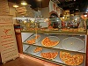

Part 1: Optimize PageSpeed Insights score for index.html

index.html
1. Minifyed index.html,css and Javascripts. In-line comments are in commentedIndex.html for reference.
2. In-lined the style.css, so as to take it out of the CRP.
3. changed loading of google font from CDN to WebFont loader.
      <!--link href="//fonts.googleapis.com/css?family=Open+Sans:400,700" rel="stylesheet" -->
      
      
4. Added media of print to remove css loading out of the CRP.
5. Made perfmatters.js async, as it is analysing performance.
6. Reduced the image size of profilePic*png to profilePicOri*png. Profile pictures were updated on all other htmls.
7. Reduced the image size  of Pizzeria.jpg to PizzeriaRed.jpg corresponding to the display.
      
8. Moved the analytics to the end before the end-body tag,so that text rendering is not blocked

Part 2: Optimize Frames per Second in pizza.html

views/css

1. Added backface-visisblity to style.css, to have pizza in its own layer .
   -webkit-backface-visibility: hidden; 
    backface-visibility: hidden; 
2. commented the width in the mover class, as the size of the image was manually reduced to 75 x 100px 
    /*width: 256px;*/

views/pizza.html

1. Reduce the natural pizzeria.jpg(pizzeriaRed.jpg) to a size appropriate for display. changed the size in images dir
    
2. Made 2 copies of pizza.png, in the images.
    First for foreground pizza(randomPizza.png) who's max display on img-responsive is 165 x 213, so reduced the size ideal      for display. Then changed the pizza.html to below.
      .

    Second copy for the background pizza(pizza.png) reduced to display size of 73 x 100px in the images dir.
3.  Did not minify html or css for readability(as CRP was not relevant for this part of the project).              

views/js/main.js

1.  Changed changePizzaSizes function having the line with document.querySelectorAll() to document.getElementsByClassName()      and changed computing of randomPizza NodeList repeatedly in the loop, by taking it out . Also moved variable declaration     outside the loop for better GC.
2.  Moved computing of scrollTop/1250 outside the loop as its constant. Moved create the var phase out of the for loop to        reduce garbage collection.
    change the line below adding css3 transforms.
    items[i].style.left = items[i].basicLeft + 100 * phase + 'px'; 
    to
    lt = -items[i].basicLeft + 1000 * phase + 'px';
    items[i].style.transform = "translateX("+lt+") translateZ(0)";
    
3. changed the # of pizza imgs to 32 from 200.
4. commented the code below, since I have reduced the size of background pizza manually.
   /* elem.style.height = "100px";
    elem.style.width = "73.333px"; */
5.  Note:Please igngore the  moverPizza.js , which has the webworker code, for moving the for loop in updatePositions to a       worker. Which I tried to implement, but was not bettering the performance. I want to retain the code for future              reference.
